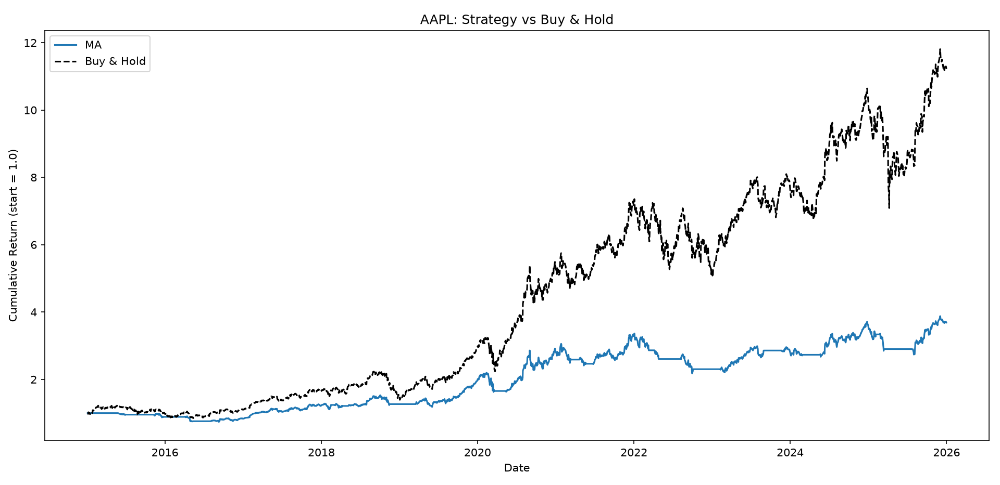
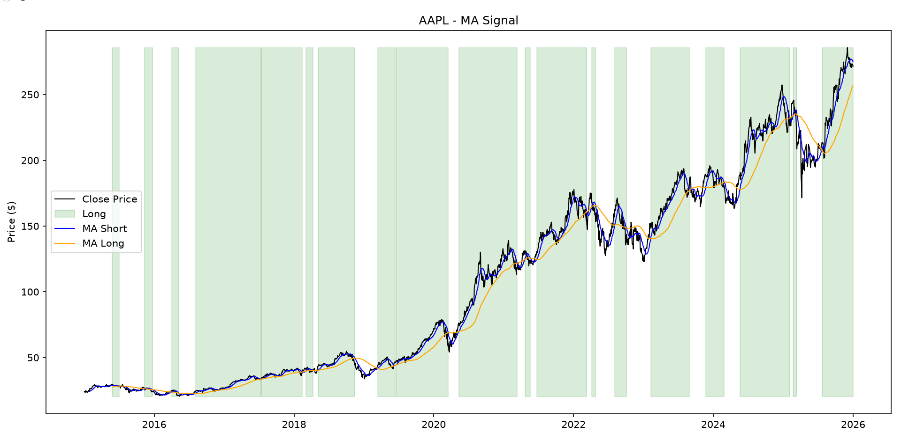

# Moving Average & Mean Reversion Backtester

## About this project

I built this project to learn the fundamentals of quantitative trading and backtesting, specifically how to implement a trading rule, 
simulate its historical performance, and evaluate it using standard risk metrics. The goal wasn't to build a strategy that "works" but to build something 
that would teach me these basics so that I could fully explain it, including where and why it fails.

The project implements two classic, well-known trading signals and compares each against simple buy-and-hold:
- **Moving average crossover** (momentum/trend following): go long when a short-term moving average is above a long-term moving average. This relies on the idea that recent price trends will continue.
- **Mean reversion** (z-score): go long when price is unusually far below its recent rolling average. This relies on the idea that extreme deviations tend to snap back toward the mean.

Backtested on AAPL, MSFT, GOOG, NVDA, SPY, and VOO from 2015–2026, using daily close prices from Yahoo Finance via yfinance.

## How to use

Set up the environment:

```bash
python3 -m venv venv
source venv/bin/activate
pip install -r requirements.txt
```

Run a single-ticker backtest with plots:

```bash
python backtester.py --ticker AAPL --strategy ma --plot
```

Run all tickers and print a results table:

```bash
python backtester.py --mode all --strategy mr
```
Other commands include: --tickers to pick your own tickers, --ma-short and --ma-long to choose your short and long window lengths, 
and --mr-entry and --mr-exit to choose when to enter and exit when using the mean reversion strategy.

## Results

Strategy vs. buy-and-hold cumulative return


Signal overlay Chart


### Metrics across tickers

| ticker   | strategy   |   strategy_sharpe |   buyhold_sharpe |   strategy_max_dd |   buyhold_max_dd |   strategy_total_return |   buyhold_total_return |
|:---------|:-----------|------------------:|-----------------:|------------------:|-----------------:|------------------------:|-----------------------:|
| AAPL     | mr         |         0.0223755 |         0.908109 |         -0.495103 |        -0.385159 |               -0.163134 |               10.2165  |
| MSFT     | mr         |         0.842487  |         0.980622 |         -0.216274 |        -0.371485 |                3.40033  |               11.1334  |
| GOOG     | mr         |         0.552588  |         0.931799 |         -0.261179 |        -0.446018 |                1.44862  |               11.0814  |
| SPY      | mr         |         0.426909  |         0.799137 |         -0.312392 |        -0.337173 |                0.715393 |                2.99743 |
| VOO      | mr         |         0.417919  |         0.800417 |         -0.316041 |        -0.33993  |                0.697601 |                3.02736 |
| NVDA     | mr         |         0.601889  |         1.35715  |         -0.48403  |        -0.663351 |                3.40155  |              385.119   |

## Limitations

1. Transaction costs: Currently this backtester assumes every trade is free and executes instantly at the exact closing price. However, I have learned that real trades has costs, such as exchange fees. This changes the sharpe ratio slightly and also negatively affects some strategies more than others. For a more realistic comparison, these transaction costs would need to be implemented.

2. Overfitting: I used standard parameter choices for the moving average windows (20/100) as well as the entry/exit thresholds for mean reversion(-1.0/0.0) rather than searching for parameters that maximized performance. I have played around with other numbers that do better but would attribute that gain to overfitting to noise since I had no separate data to confirm it generalizes.

3. Regime dependency: These results are conditional on the specific period and assets tested. For example, AAPL's long uptrend likely favored the moving average strategy over the mean reversion strategy, but a choppier period or asset would likely reverse that ranking.

4. What I'd work on next: To reinforce my overfitting assumption, I would perform some form of walk-forward testing. By splitting the data into a training and test period, I can confirm if the strategies' results are a pattern or if they follow some other model.
